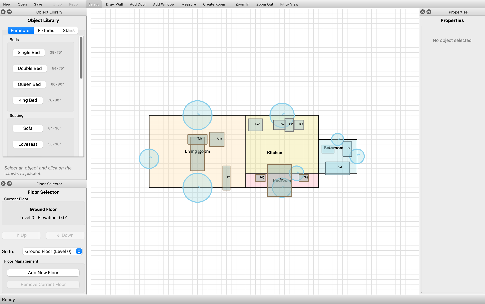
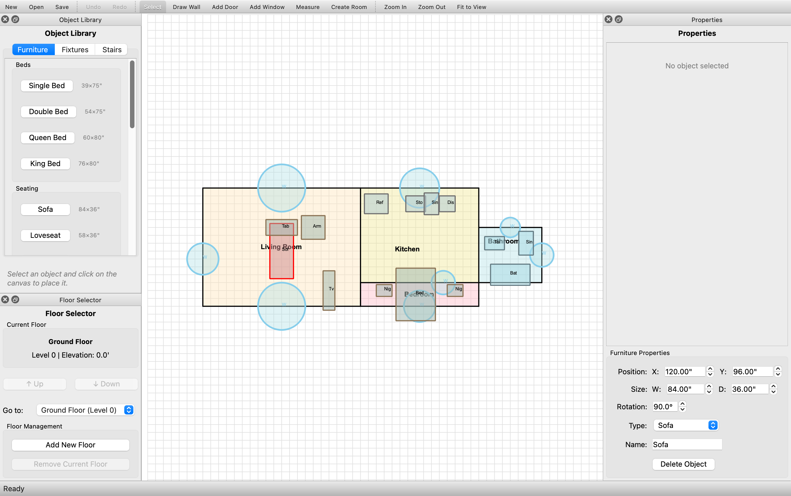
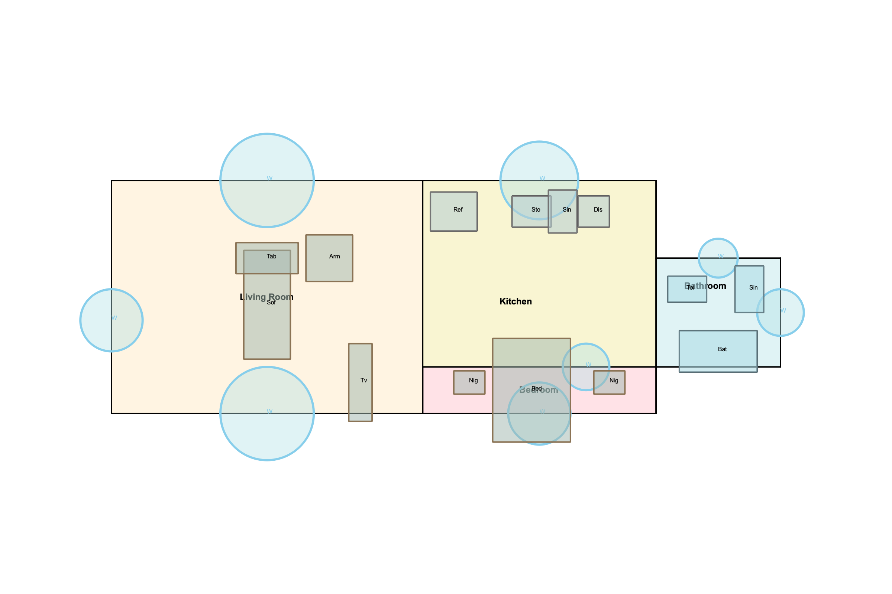
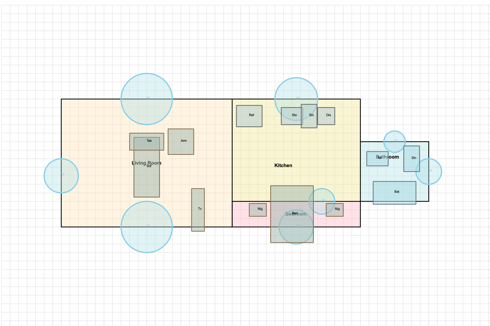
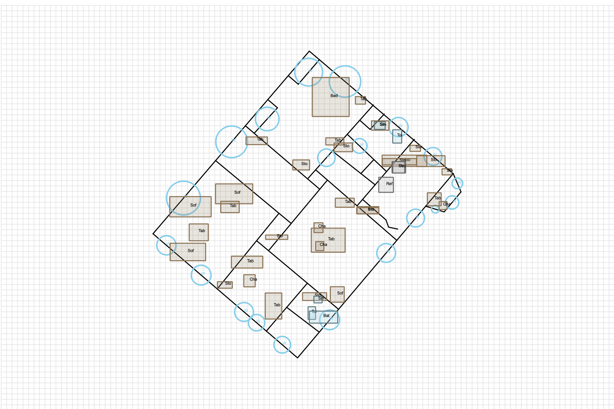

# Floor Plan Editor

An interactive 2D architectural floor plan editor built with Python and PyQt6. Create, edit, and export professional floor plans with walls, doors, windows, furniture, fixtures, and multi-story support. Import floor plans directly from iPhone LiDAR scans.



## Features

### Floor Plan Drawing
- Interactive wall drawing with snap-to-grid
- Door and window placement (17+ types: french doors, sliding, bay windows, etc.)
- Room creation with color fills and labels
- Multi-floor building support
- Grid display with zoom and pan

### Object Manipulation
- Click to select furniture, fixtures, and stairs
- Drag to move, corner handles to resize, rotation handle to rotate
- Properties panel for precise position, size, and rotation editing
- Full undo/redo for all transformations



### Import/Export
- Import from iPhone LiDAR scans (Apple RoomPlan JSON format)
- Save/load native `.floorplan` format (JSON-based)
- Export to PNG and PDF with title blocks and scale notation

### Object Library
- 18 furniture types: beds, sofas, tables, desks, chairs, bookshelves
- 18 fixture types: toilets, sinks, stoves, refrigerators, washers
- 6 stair types: straight, L-shaped, U-shaped, spiral

## Quick Start

### Installation

```bash
pip install -r requirements.txt
```

The only dependency is **PyQt6** (>= 6.4.0).

### Run the Application

```bash
python main.py
```

Optionally load an existing floor plan:

```bash
python main.py data/examples/comprehensive_house.floorplan
```

### Basic Workflow

1. Use the toolbar to select a drawing tool (Draw Wall, Add Door, Add Window)
2. Click on the canvas to draw walls, place doors on walls, etc.
3. Press **S** to switch to Select mode for editing objects
4. Use the Object Library panel to place furniture and fixtures
5. Save your work with **Ctrl+S**

## Screenshots

### Clean Floor Plan Render



### Floor Plan with Grid



### iPhone LiDAR Scan Import



## Keyboard Shortcuts

| Shortcut | Action |
|----------|--------|
| **S** | Select tool |
| **W** | Draw wall |
| **D** | Add door |
| **N** | Add window |
| **M** | Measure |
| **G** | Toggle grid |
| **Delete** | Delete selected object |
| **Escape** | Deselect |
| **Ctrl+N** | New floor plan |
| **Ctrl+O** | Open file |
| **Ctrl+S** | Save |
| **Ctrl+Z** | Undo |
| **Ctrl+Shift+Z** | Redo |
| **Ctrl+C / Ctrl+V** | Copy / Paste |
| **Ctrl+D** | Toggle dimensions |
| **Ctrl+0** | Fit to view |
| **Ctrl+I** | Import iPhone scan |

## Project Structure

```
floorplan_app/
├── core/                       # Data models (no UI dependencies)
│   ├── geometry.py             # Point, Wall, Opening, Room, FloorPlan, Furniture, etc.
│   └── level.py                # Building, multi-floor support
├── gui/                        # PyQt6 user interface
│   ├── main_window.py          # Main application window, menus, toolbars
│   ├── canvas.py               # Interactive 2D drawing canvas
│   ├── object_selection.py     # Object selection and transformation engine
│   ├── properties_panel.py     # Property editor for selected objects
│   ├── object_library.py       # Furniture/fixture library panel
│   ├── floor_selector.py       # Multi-floor navigation widget
│   └── viewer_3d.py            # Basic 3D visualization
├── utils/                      # Utilities and cross-cutting concerns
│   ├── logging_config.py       # Logging setup and AppConfig constants
│   ├── undo_stack.py           # Undo/redo command pattern
│   ├── undo_commands.py        # Object transformation undo/redo
│   ├── export.py               # PNG/PDF export
│   ├── roomplan_importer.py    # iPhone LiDAR scan importer
│   ├── measurements.py         # Area/perimeter calculations
│   ├── transforms.py           # Move, rotate, array transforms
│   ├── annotations.py          # Text and dimension annotations
│   └── clipboard.py            # Copy/paste support
├── data/
│   ├── examples/               # Example floor plans and creation scripts
│   └── iphone_scans/           # Sample iPhone LiDAR scan JSON files
├── scripts/
│   └── generate_screenshots.py # Generate documentation screenshots
├── tests/                      # Test and debug scripts
├── docs/                       # Documentation and images
├── RoomScanner/                # iOS companion app (SwiftUI/RoomPlan)
├── main.py                     # Application entry point
├── requirements.txt            # Python dependencies
└── LICENSE                     # MIT License
```

## Architecture

The application follows a three-layer architecture:

- **Core Layer** (`core/`) -- Pure data structures with JSON serialization. No UI dependencies. Contains `FloorPlan`, `Building`, `Wall`, `Opening`, `Room`, `Furniture`, `Fixture`, and `Stair` classes.
- **GUI Layer** (`gui/`) -- PyQt6 widgets for interactive editing. The `FloorPlanCanvas` handles all drawing and mouse interaction. `MainWindow` provides menus, toolbars, and dock panels.
- **Utils Layer** (`utils/`) -- Cross-cutting concerns: undo/redo (command pattern), import/export, measurements, and logging.

Design patterns used: MVC, Command (undo/redo), Observer (Qt signals/slots), Singleton (clipboard).

For detailed architecture documentation, see [`docs/ARCHITECTURE.md`](docs/ARCHITECTURE.md).

## iOS Companion App

The `RoomScanner/` directory contains a SwiftUI iOS app that captures room scans using Apple's RoomPlan framework and iPhone LiDAR sensor. Scans are exported as JSON and can be imported into the desktop editor via **File > Import iPhone Scan** or **Ctrl+I**.

See [`RoomScanner/README.md`](RoomScanner/README.md) for setup instructions.

## Generating Screenshots

To regenerate the documentation screenshots:

```bash
python scripts/generate_screenshots.py
```

This creates a demo floor plan, launches the GUI, and captures images to `docs/images/`.

## License

MIT License. See [LICENSE](LICENSE) for details.
